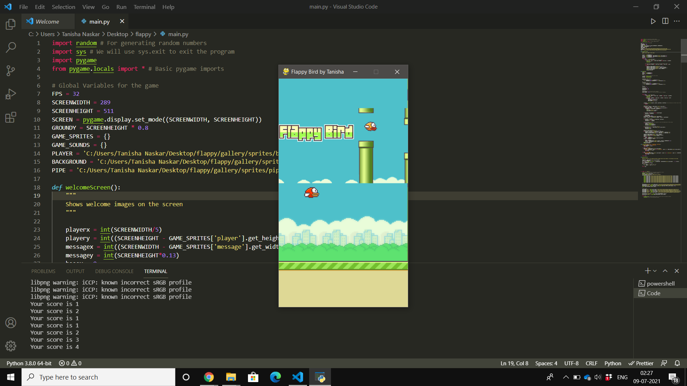

# Flappy_Bird_Game
### Flappy Bird Game is developed in Python Programming Language and it is a desktop application.This project system used a Pygame and Random module. Pygame is a cross-platform set of Python modules designed for writing video games.This Flappy Bird Game has a task record contains images file, sounds file and python contents file (main.py). The ongoing interaction Graphics is sufficient and the controls are straightforward for the clients.
---
### Instructions
1.Discussing the ongoing interaction, it’s one of the most addictive and messed around for all. All the playing strategies are too straightforward simply like the genuine one.

2.You should simply attempt to remain in the screen until long green channels show up before you. Here, the client needs to control the winged animal fluttering up, down utilizing Spacebar, without contacting pipes so as to score game focuses.

3.This implies the more you go through green funnels, more will be the game focuses. A straightforward GUI is accommodated the simple ongoing interaction.
---
### Output

